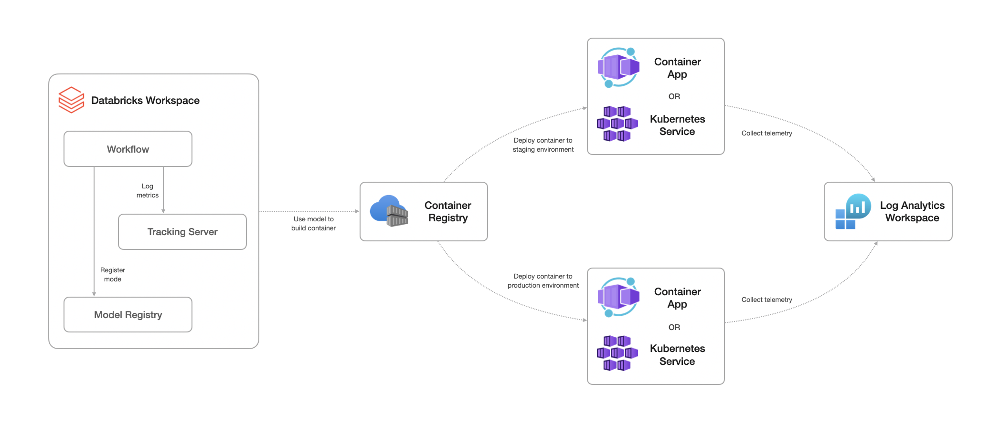
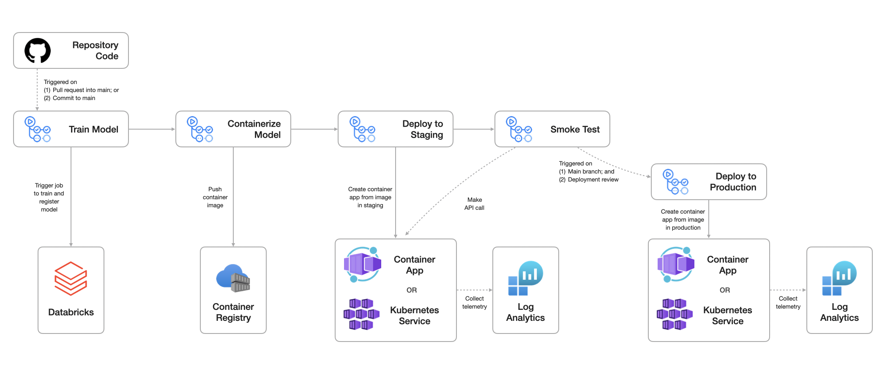

# Getting Started

The purpose of this section is to provide an overview of each example scenario.

## Potential Use Cases

This approach is best suited for:

- Low-latency and interactive workloads
- Exposing machine learning models as a REST API to integrate with external applications
- Preference to deploy models as containers on infrastructure other than Azure Databricks.
- Need to use machine learning models in remote locations or edge devices with limited connectivity to Azure Databricks.

> [!NOTE]
>
> - Databricks Model Serving is a Databricks-native appraoch to deploying models. This appraoch is less flexible than deploying models as containers, but it is easier to use and manage.
> - This approach is not recommended for batch inference scenarios.

## Solution Design

The below diagram shows a high-level design for implementing online scoring workloads suitable for classical machine learning scenarios using Azure Machine Learning.



The solution consists of the following services:

- **[Databricks](https://learn.microsoft.com/azure/databricks/introduction/)**: Used for training and registering the model.
- **[Container Registry](https://learn.microsoft.com/azure/container-registry/container-registry-intro)**: Used for storing the Docker image.
- **[Container App Environment](https://learn.microsoft.com/azure/container-apps/environment)**: Used for hosting Container Apps.
- **[Container App](https://learn.microsoft.com/azure/container-apps/containers)**: Used for exposing the container as a REST API.
- **[Kubernetes Service](https://learn.microsoft.com/azure/aks/what-is-aks)**: Used for exposing the container as a REST API.
- **[Log Analytics Workspace](https://learn.microsoft.com/azure/azure-monitor/logs/log-analytics-overview)**: Used for monitoring the container app.

The typical workflow for this solution is as follows:

1. Train and register a model using Databricks using Databricks Asset Bundles. Model metrics will be logged in the MLflow tracking server. Model artifacts will be stored and versioned in the Databricks workspace model registry.
2. Download the model artifacts from the Databricks workspace model registry and package them into a Docker image. The Docker image will contain the model, the scoring script, and any dependencies required for the model to be consumed. The Docker image will be pushed to the Azure Container Registry.
3. Deploy the Docker image as a Container App in the Azure Container App Environment or a service on an Azure Kubernetes cluster. The service will expose the model as a REST API.
4. Review the logs and metrics in the Log Analytics workspace. This can be used to monitor the performance of the model and the application.

> [!CAUTION]
> This solution design is intended for proof-of-concept scenarios and is not recommended for enterprise production scenarios. It is advised to review and adjust the design based on your specific requirements if you plan to use this in a production environment. This could include:
>
> - Securing the solution through network controls.
> - Upflift observability by enabling monitoring and logging for different services.
> - Defining an operational support and lifecycle management plan for the solution.
> - Implementing alerting and notification mechanisms to notify support teams of any issues (e.g. performance, budget, etc.).
>
> The Azure Well-Architected Framework provides guidance on best practices for designing, building, and maintaining cloud solutions. For more information, see the [Azure Well-Architected Framework](https://learn.microsoft.com/azure/well-architected/what-is-well-architected-framework).

## Automated Deployment Workflow

The below diagram shows the overall CI/CD process as built with GitHub Actions. This approach consists of three environments consisting of an identical set of resources.



The environments include:

- **Development:** used by developers to build and test their solutions.
- **Staging:** used to test deployments before going to production in a production-like environment. Any integration tests are run in this environment.
- **Production:** used for the final production environment.

The end-to-end workflow operation consists of:

1. Triggering the `Model Build` workflow based on an event (e.g. merging code to the main branch via a pull request). This will trigger a job in the Databricks workspace that will result in a new model being registered.
2. Triggering the `Containerize Model` workflow on completion of the `Model Build` workflow. This will result in a new Docker image being built and pushed to the Azure Container Registry.
3. Triggering the `Deploy to Staging` workflow on completion of the `Containerize Model` workflow. This will result in the new Docker image being deployed as a Container App or as a service on an Azure Kubernetes cluster in the staging environment.
4. Triggering the `Smoke Test` workflow on completion of the `Deploy to Staging` workflow. This will run a test to ensure the deployment is successful.
5. The `Deploy to Production` workflow will only be triggered after the `Deploy to Staging` workflow has completed successfully, the current branch is set to `main` (reflecting the production state of the codebase), and the user has approved the deployment.

> [!NOTE]
> The current workflows are designed to be triggered manually for ease of demonstration. However, they can be modified to be triggered automatically based on specific events.
>
> After developers have tested their code in the development environment, they can merge their code to the main branch via a pull request. This will trigger steps (1) to (4) automatically, but will not deploy to the production environment. This will validate that the code is working as expected in the staging environment, and allow the team to make adjustments if needed.
>
> The GitHub Action workflow `on` trigger will contain the following block to ensure it is triggered only when pull requests into the main branch are opened:
>
>```yml
>on:
>  pull_request:
>    types:
>      - opened
>      - synchronize
>    branches:
>      - main
> ```
>
> Once the team is ready to deploy to production, the pull request can be approved and merged into the main branch. This will trigger steps (1) to (5) as described above to deploy the code to the production environment.
>
> The GitHub Action workflow `on` trigger will contain the following block to ensure it is triggered only when new code is pushed into the main branch:
>
>```yml
>on:
>  push:
>    branches:
>     - main
> ```

## Related Resources

- [MLOps workflows on Databricks](https://docs.databricks.com/en/machine-learning/mlops/mlops-workflow.html)
- [What are Databricks Asset Bundles?](https://docs.databricks.com/en/dev-tools/bundles/index.html)
- [What is FAST API?](https://fastapi.tiangolo.com)
