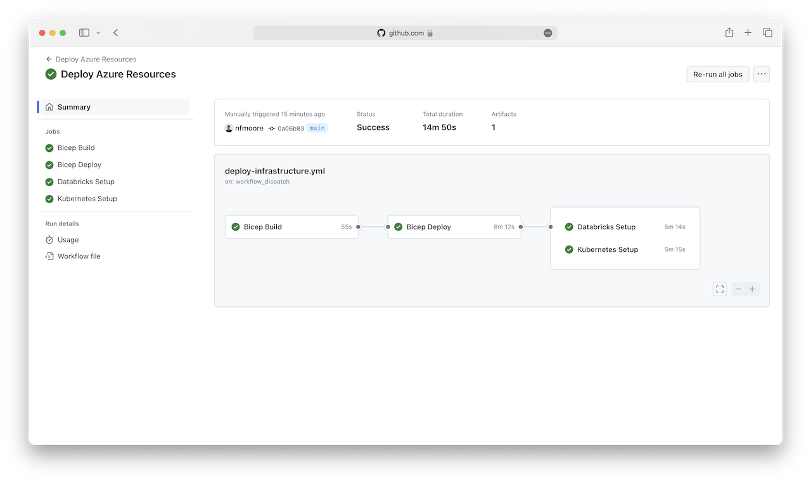
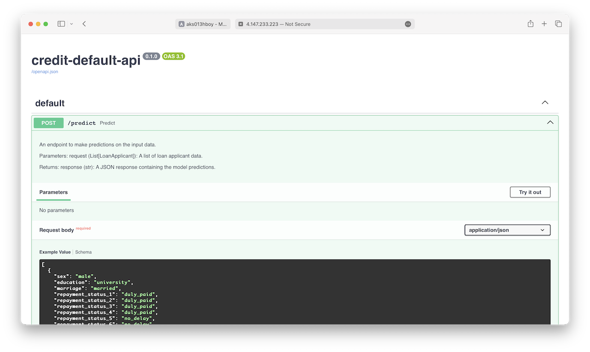

# Step-by-Step Setup

The purpose of this section is to describe the steps required to setup each example scenario.

> [!TIP]
>
> - The following options are recommended to complete the setup:
>   1. Using the [Azure Cloud Shell](https://learn.microsoft.com/azure/cloud-shell/overview) within the Azure Portal.
>   2. Using a [GitHub Codespace](https://docs.github.com/en/codespaces/prebuilding-your-codespaces/about-github-codespaces-prebuilds)
>   3. Using your local VSCode environment with the environment specified in the [development container](https://docs.github.com/en/codespaces/setting-up-your-project-for-codespaces/adding-a-dev-container-configuration/introduction-to-dev-containers). This will be the most efficient way to complete the setup.
> - The example scenarios are designed to be executed in sequence.

> [!WARNING]
>
> - As with all Azure Deployments, this will incur associated costs. Remember to teardown all related resources after use to avoid unnecessary costs.
> - If you use the Azure Cloud Shell you may need to update the version of the GitHub CLI.
> - If you use a GitHub Codespace you may encounter HTTP 403 errors when executing GitHub CLI commands. If you encounter these issues try executing `export GITHUB_TOKEN=` to overwrite the GITHUB_TOKEN environment variable then execute `gh auth login`. Codespaces also uses GITHUB_TOKEN, but the token used is less permissive.

> [!NOTE]
>
> - Common setup section should take 25 minutes to complete.
> - Example scenarios should take 35 minutes to complete.

## Prerequisites

Before implementing this example scenario the following is needed:

- Azure subscription with Owner permissions.
- GitHub account.

## 1. Common Setup

## 1.1. Create a GitHub repository

1. Log in to your GitHub account and navigate to the [azure-databricks-containers-mlops-example-scenarios](https://github.com/nfmoore/azure-databricks-containers-mlops-example-scenarios) repository and click `Use this template` to create a new repository from this template.

    Rename the template and leave it public. Ensure you click `Include all branches` to copy all branches.

> [!NOTE]
>
> - You can learn more about creating a repository from a template [here](https://docs.github.com/en/repositories/creating-and-managing-repositories/creating-a-template-repository).

## 1.2. Configure a federated identity credential on a service principal

1. Create a Microsoft Entra application by executing the following command:

    ```bash
    az ad app create --display-name <your-display-name>
    ```

    Take note of the `appId` value (the Application ID or Client ID) returned by the command as it will be used in the next step.

2. Create a Microsoft Entra service principal by executing the following command:

    ```bash
    az ad sp create --id <your-application-id>
    ```

    Take note of the `id` value (the Object ID or Principal ID) returned by the command as it will be used in the next step.

3. Assign the service principal as a `Owner` of an Azure subscription by executing the following command:

    ```bash
    az role assignment create \
    --role "Owner" \
    --assignee-object-id <your-object-id> \
    --assignee-principal-type ServicePrincipal \
    --scope /subscriptions/<your-subscription-id>
    ```

4. Create federated credentials for your Microsoft Entra application by executing the following command:

    ```bash
    # set environment variables for the federated credentials
    export APPLICATION_ID=<your-application-id> # replace with your application id
    export REPOSITORY_NAME=example-scenarios-databricks-containers-mlops # replace with your repository name
    export OWNER=<your-username># replace with your GitHub username

    # create federated credential for workflows targeting the Production environment
    az ad app federated-credential create \
    --id $APPLICATION_ID \
    --parameters '{
        "name": "ProductionEnvironmentCredential",
        "issuer": "https://token.actions.githubusercontent.com",
        "subject": "repo:'${OWNER}'/'${REPOSITORY_NAME}':environment:Production",
        "description": "Federated credential for workflows in the Production environment",
        "audiences": [ "api://AzureADTokenExchange" ]
    }'

    # create federated credential for jobs tied to the Staging environment
    az ad app federated-credential create \
    --id $APPLICATION_ID \
    --parameters '{
        "name": "StagingEnvironmentCredential",
        "issuer": "https://token.actions.githubusercontent.com",
        "subject": "repo:'${OWNER}'/'${REPOSITORY_NAME}':environment:Staging",
        "description": "Federated credential for jobs tied to the Staging environment",
        "audiences": [ "api://AzureADTokenExchange" ]
    }'

    # create federated credential for jobs tied to the main branch
    az ad app federated-credential create \
    --id $APPLICATION_ID \
    --parameters '{
        "name": "MainBranchCredential",
        "issuer": "https://token.actions.githubusercontent.com",
        "subject": "repo:'${OWNER}'/'${REPOSITORY_NAME}':ref:refs/heads/main",
        "description": "Federated credential for jobs tied to the main branch",
        "audiences": [ "api://AzureADTokenExchange" ]
    }'
    ```

After executing these steps you will have a federated identity credential on a service principal that can be used to authenticate with Azure services. This can be viewed in Microsoft Entra by navigating to the `App registrations` blade and selecting the application created in step 1.


> [!NOTE]
>
> - Ensure note of the Client ID, Tenant ID and Subscription ID as they will be used in the next steps.
> - More information about  setting up an Azure Login with OpenID Connect and use it in a GitHub Actions workflow is available [here](https://learn.microsoft.com/azure/developer/github/connect-from-azure?tabs=azure-cli).

## 1.3. Configure GitHub repository secrets, variables, and environments

**Method 1: GitHub CLI**:

1. Create the following GitHub Actions repository secrets by executing the following command:

    ```bash
    # optional - used to authenticate with your GitHub account
    gh auth login

    # set environment variables for GitHub repository secrets
    export AZURE_CLIENT_ID=<your-client-id>
    export AZURE_TENANT_ID=<your-tenant-id>
    export AZURE_SUBSCRIPTION_ID=<your-subscription-id>

    # set GitHub repository secrets
    gh secret set AZURE_CLIENT_ID --body "$AZURE_CLIENT_ID"
    gh secret set AZURE_TENANT_ID --body "$AZURE_TENANT_ID"
    gh secret set AZURE_SUBSCRIPTION_ID --body "$AZURE_SUBSCRIPTION_ID"
    ```

2. Create the following GitHub Actions repository variables by executing the following command:

    ```bash
    # optional - used to authenticate with your GitHub account
    gh auth login

    # set environment variables for GitHub repository variables
    export DEPLOYMENT_LOCATION=<your-azure-region> # region to deploy resources e.g. australiaeast
    export BASE_NAME=example-scenarios-databricks-containers-mlops # set for convenience
    export DEPLOYMENT_RESOURCE_GROUP_NAME=rg-$BASE_NAME-01
    export DEPLOYMENT_DATARBICKS_MANAGED_RESOURCE_GROUP_NAME=rgm-databricks-$BASE_NAME-01
    export DEPLOYMENT_KUBERNETES_MANAGED_RESOURCE_GROUP_NAME=rgm-kubernetes-$BASE_NAME-01
    export DEPLOY_CONTAINER_APPS=true # requred to deploy Azure Container Apps for the Container Apps scenario
    export DEPLOY_KUBERNETES=true # requred to deploy Azure Kubernetes Service for the Kubernetes Service scenario

    # set GitHub repository variables
    gh variable set DEPLOYMENT_LOCATION --body "$DEPLOYMENT_LOCATION"
    gh variable set DEPLOYMENT_RESOURCE_GROUP_NAME --body "$DEPLOYMENT_RESOURCE_GROUP_NAME"
    gh variable set DEPLOYMENT_DATARBICKS_MANAGED_RESOURCE_GROUP_NAME --body "$DEPLOYMENT_DATARBICKS_MANAGED_RESOURCE_GROUP_NAME"
    gh variable set DEPLOYMENT_KUBERNETES_MANAGED_RESOURCE_GROUP_NAME --body "$DEPLOYMENT_KUBERNETES_MANAGED_RESOURCE_GROUP_NAME"
    gh variable set DEPLOY_KUBERNETES --body true
    gh variable set DEPLOY_CONTAINER_APPS  --body true
    ```

3. Create the following GitHub Actions environments by executing the following command:

    ```bash
    # optional - used to authenticate with your GitHub account
    gh auth login

    # set environment variables for GitHub repository environments
    OWNER=$(gh api user | jq -r '.login')
    OWNER_ID=$(gh api user | jq -r '.id')
    REPOSITORY_NAME=$(gh repo view --json name | jq '.name' -r)

    # create the staging environment
    gh api \
    --method PUT \
    -H "Accept: application/vnd.github+json" \
    -H "X-GitHub-Api-Version: 2022-11-28" \
    /repos/$OWNER/$REPOSITORY_NAME/environments/Staging

    # create the production environment with a reviewer and a wait timer
    gh api \
    --method PUT \
    -H "Accept: application/vnd.github+json" \
    -H "X-GitHub-Api-Version: 2022-11-28" \
    /repos/$OWNER/$REPOSITORY_NAME/environments/Production \
    -F "prevent_self_review=false" -f "reviewers[][type]=User" -F "reviewers[][id]=$OWNER_ID"
    ```

**Method 2: GitHub Actions UI**:

1. Create the following GitHub Actions repository secrets by:
   1. Navigate to the GitHub repository.
   2. Click on the `Settings` tab.
   3. Click on the `Secrets and variables` link and selecting `Actions`.
   4. Clicking on the `New repository secret` button.
   5. Add the following secrets:
        - `AZURE_CLIENT_ID` with the value of the `Client ID` from the federated identity credential.
        - `AZURE_TENANT_ID` with the value of the `Tenant ID` from the federated identity credential.
        - `AZURE_SUBSCRIPTION_ID` with the value of the `Subscription ID` from the federated identity credential.

2. Create the following GitHub Actions repository variables by:
    1. Navigate to the GitHub repository.
    2. Click on the `Settings` tab.
    3. Click on the `Secrets and variables` link and selecting `Actions`.
    4. Clicking on `Variables` in the tab.
    5. Clicking on the `New repository variable` button.
    6. Add the following variables:
        - `DEPLOYMENT_LOCATION` with the value of the Azure region to deploy resources.
        - `DEPLOYMENT_RESOURCE_GROUP_NAME` with the value of the resource group name for the deployment.
        - `DEPLOYMENT_DATARBICKS_MANAGED_RESOURCE_GROUP_NAME` with the value of the resource group name for the Databricks managed resources.
        - `DEPLOYMENT_KUBERNETES_MANAGED_RESOURCE_GROUP_NAME` with the value of the resource group name for the Kubernetes managed resources.
        - `DEPLOY_CONTAINER_APPS` with the value of `true` to deploy Azure Container Apps for the Container Apps scenario.
        - `DEPLOY_KUBERNETES` with the value of `true` to deploy Azure Kubernetes Service for the Kubernetes Service scenario.

3. Create the following GitHub Actions environments by:
    1. Navigate to the GitHub repository.
    2. Click on the `Settings` tab.
    3. Click on the `Environments` link.
    4. Click on the `New environment` button.
    5. Add the following environments:
        - `Staging` with no reviewers.
        - `Production` with a reviewer and a wait timer.

After executing these steps you will have configured the GitHub repository with the required secrets, variables, and environments.


> [!NOTE]
>
> - More information about using secrets in GitHub Actions is available [here](https://docs.github.com/en/actions/security-guides/using-secrets-in-github-actions).
> - More information about using variables in GitHub Actions is available [here](https://docs.github.com/en/actions/learn-github-actions/variables).
> - More information about using environments for deployments in GitHub Actions is available [here](https://docs.github.com/en/actions/deployment/targeting-different-environments/using-environments-for-deployment).

## 1.4. Deploy Azure Resources

Execute the `Deploy Azure Resources` workflow to deploy all Azure resources required for the example scenarios.

To workflow can be executed via the following methods:

**Method 1: GitHub CLI**:

1. Trigger the workflow via the GitHub CLI by executing the following command:

    ```bash
    # optional - used to authenticate with your GitHub account
    gh auth login

    # trigger the workflow
    gh workflow run "Deploy Azure Resources"
    ```

**Method 2: GitHub Actions UI**:

1. Manually trigger the workflow via the GitHub Actions UI by following these steps:

   1. Navigate to the GitHub repository.
   2. Click on the `Actions` tab.
   3. Click on the `Deploy Azure Resources` workflow.
   4. Click on the `Run workflow` button.
   5. Click on the `Run workflow` button again to confirm the action.

After executing these steps you will have deployed all Azure resources required for the example scenarios.




> [!NOTE]
>
> - The `Deploy Azure Resources` workflow is configured with a `workflow_dispatch` trigger (a manual process) for illistration purposes only.
> - The service principal is added as an workspace administrator to the Databricks workspace. This same service principal will be used to authenticate with Azure Databricks to create different artefacts such as clusters, jobs, and notebooks. This is present in all GitHub Actions workflows in this repository.
> - More information about CI/CD with GitHub Actions is available [here](https://docs.github.com/en/actions/learn-github-actions/understanding-github-actions).

## 2. Example Sceanrios

## 2.1. Azure Container Apps

Execute the `Deploy to Container Apps` workflow to train a model, create a container image, deploy the image to an Azure Container App, and smoke test the deployed model.

To workflow can be executed via the following methods:

**Method 1: GitHub CLI**:

1. Trigger the workflow via the GitHub CLI by executing the following command:

    ```bash
    # optional - used to authenticate with your GitHub account
    gh auth login

    # trigger the workflow
    gh workflow run "Deploy to Container Apps"
    ```

**Method 2: GitHub Actions UI**:

1. Manually trigger the workflow via the GitHub Actions UI by following these steps:

   1. Navigate to the GitHub repository.
   2. Click on the `Actions` tab.
   3. Click on the `Deploy to Container Apps` workflow.
   4. Click on the `Run workflow` button.
   5. Click on the `Run workflow` button again to confirm the action.

After executing these steps the `Deploy to Container Apps` workflow will train a model, create a container image, deploy the image to an Azure Container App, and smoke test the deployed model.

After the `Train Model` job completes you will have registered a model in the Databricks workspace.


After the `Build Container` job and `Staging Deployment` job completes you will have deployed a container image to Azure Container Apps in the `Staging` environment.

You will be prompted to review the deployment before deploying the container to the `Production` environment. Click the `Review deployments` button to give approval and commence the Production job.


After the `Production Deployment` job completes you will have deployed a container image to Azure Container Apps in the `Production` environment.

You can view the Container App in the Azure portal by clicking on the `Container App` resource.


By clicking `Application Url` you can view the Swagger UI for [FastAPI](https://fastapi.tiangolo.com) service. This page displays the API endpoints you can consume as part of the service.


You can view logs for the Container App by clicking on the `Logs` tab. This will display the logs for the Container App.

For example, you can view model related telemetry by execuring the following Kusto query:

```kql
ContainerAppConsoleLogs_CL
| where Log_s has 'credit-default-api'
| extend Log_s = trim("INFO:root:", Log_s)
| project TimeGenerated, Data=parse_json(tostring(Log_s))
| evaluate bag_unpack(Data)
```


> [!IMPORTANT]
>
> - The `Deploy Azure Resources` workflow is a prerequisite for the `Deploy to Container Apps` workflow.

> [!NOTE]
>
> - The `Deploy to Container Apps` workflow is configured with a `workflow_dispatch` trigger (a manual process) for illistration purposes only.
> - More information about CI/CD with GitHub Actions is available [here](https://docs.github.com/en/actions/learn-github-actions/understanding-github-actions).

## 2.2. Azure Kubernetes Service

Execute the `Deploy to Kubernetes Service` workflow to train a model, create a container image, deploy the image to Azure Kubernetes Service, and smoke test the deployed model.

To workflow can be executed via the following methods:

**Method 1: GitHub CLI**:

1. Trigger the workflow via the GitHub CLI by executing the following command:

    ```bash
    gh auth login # (optional - used to authenticate with your GitHub account)
    gh workflow run "Deploy to Kubernetes Service"
    ```

**Method 2: GitHub Actions UI**:

1. Manually trigger the workflow via the GitHub Actions UI by following these steps:

   1. Navigate to the GitHub repository.
   2. Click on the `Actions` tab.
   3. Click on the `Deploy to Kubernetes Service` workflow.
   4. Click on the `Run workflow` button.
   5. Click on the `Run workflow` button again to confirm the action.

After executing these steps the `Deploy to Kubernetes Service` workflow will train a model, create a container image, deploy the image to an Azure Kubernetes Service as a deployment, and smoke test the deployed model.

After the `Train Model` job completes you will have registered a model in the Databricks workspace.


After the `Build Container` job and `Staging Deployment` job completes you will have deployed a container image to Azure Kubernetes Service in the `Staging` environment.

You will be prompted to review the deployment before deploying the container to the `Production` environment. Click the `Review deployments` button to give approval and commence the Production job.


After the `Production Deployment` job completes you will have deployed a container image to Azure Kubernetes Service in the `Production` environment.

You can view the Azure Kubernetes Service deployment in the Azure portal by clicking on the `Kubernetes service` resource.


By selecting the `Workloads` tab, and clicking on the `External IP` for the `credit-default-api` service you can view the Swagger UI for [FastAPI](https://fastapi.tiangolo.com) service. This page displays the API endpoints you can consume as part of the service.



You can view logs for the service by clicking on the `Logs` tab. This will display the logs for the service.

For example, you can view model related telemetry by execuring the following Kusto query:

```kql
ContainerLog
| where LogEntry has 'credit-default-api'
| extend LogEntry = trim("INFO:root:", LogEntry)
| project TimeGenerated, Data=parse_json(tostring(LogEntry))
| evaluate bag_unpack(Data)
```


> [!IMPORTANT]
>
> - The `Deploy Azure Resources` workflow is a prerequisite for the `Deploy to Kubernetes Service` workflow.

> [!NOTE]
>
> - The `Deploy to Kubernetes Service` workflow is configured with a `workflow_dispatch` trigger (a manual process) for illistration purposes only.
> - More information about CI/CD with GitHub Actions is available [here](https://docs.github.com/en/actions/learn-github-actions/understanding-github-actions).
