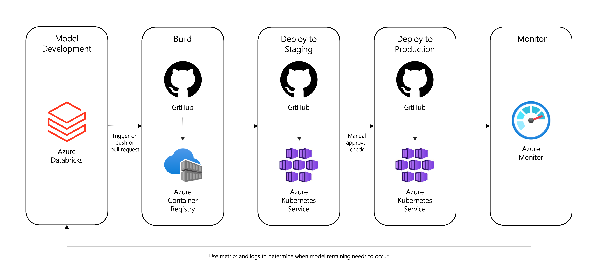

# Proof-of-Concept: Deploying an MLFlow Model for Real-Time Inference using Databricks and Kubernetes

## Overview

This repository contains resources for an end-to-end proof of concept which illustrates how an ML Flow model can be trained on Databricks, packaged as a webservice, deployed to Kubernetes via CI/CD and monitored within Microsoft Azure. A high-level solution design is shown below:

## Getting Started

This repository contains detailed step-by-step instructions on how to implement this solution in your Microsoft Azure subscription. At a high-level an implementation contains four main stages:

- **Infrastructure Setup:** this includes an Azure Databricks workspace, an Azure Log Analytics workspace, an Azure Container Registry, and 2 Azure Kubernetes clusters (for a staging and production environment respectively).

- **Model Development:** this includes core components of the model development process such as experiment tracking and model registration. An Azure Databricks Workspace will be used to develop three ML Flow models to generate predictions, access data drift and determine outliers.

- **Model Deployment:** this includes implementing a CI/CD pipeline with GitHub Actions to package the three ML Flow models as an API for model serving. BentoML will be used to containerise the web API for deployment on separate Azure Kubernetes clusters for Staging and Production respectively.

- **Model Monitoring:** this includes using Azure Monitor for containers to monitor the health and performance of the API. In addition, Log Analytics will be used to monitor data drift and outliers by analysing log telemetry.

For detailed step-by-step instructions see the [Implementation Guide](.github/docs/implementation-guide.md).

## License

Details on licensing for the project can be found in the [LICENSE](./LICENSE) file.
